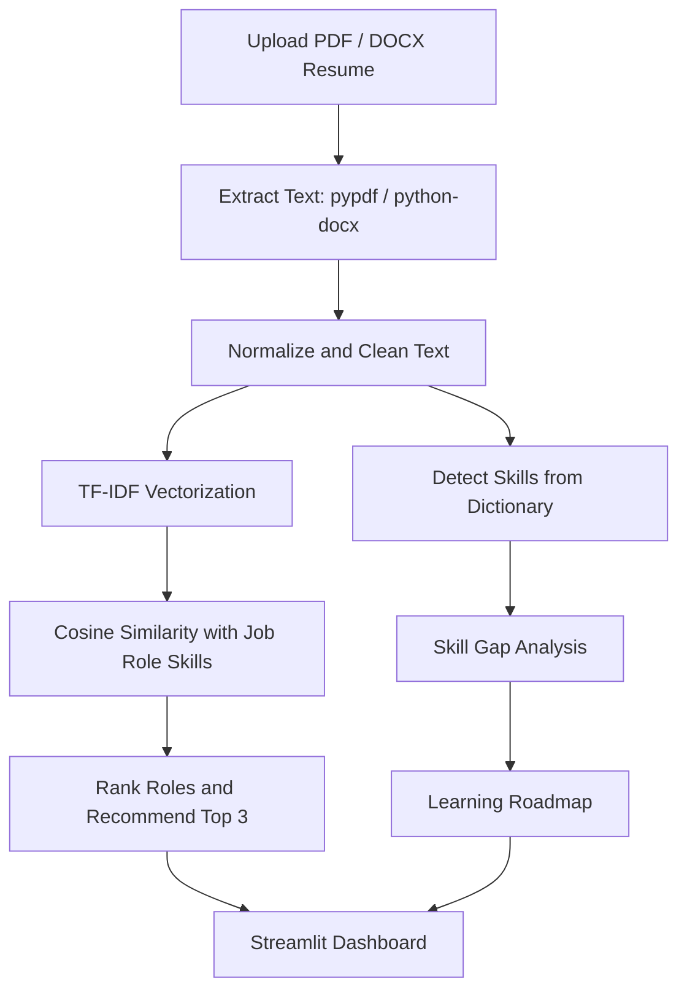

# Resume Analyzer Workflow

```mermaid
flowchart TD
 A[Upload PDF / DOCX Resume] --> B[Extract Text: pypdf / python-docx]
 B --> C[Normalize and Clean Text]
 C --> D[Detect Skills from Dictionary]
 C --> E[TF-IDF Vectorization]
 E --> F[Cosine Similarity with Job Role Skills]
 D --> G[Skill Gap Analysis]
 F --> H[Rank Roles and Recommend Top 3]
 G --> I[Learning Roadmap]
 H --> J[Streamlit Dashboard]
 I --> J
```
